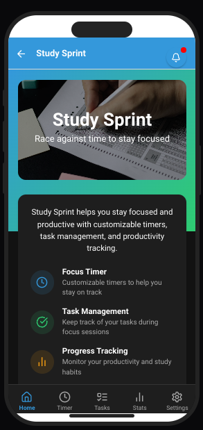
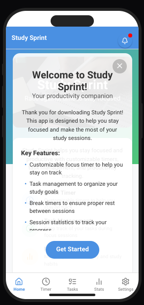
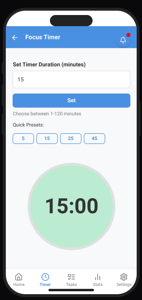
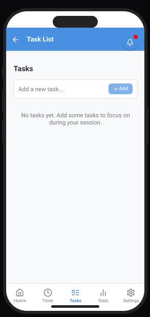
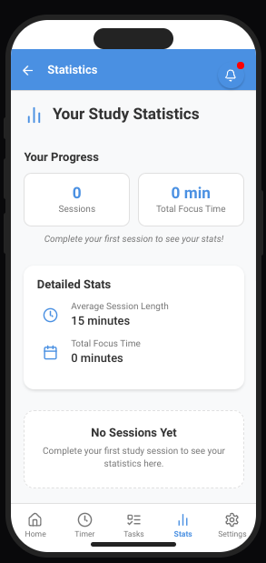
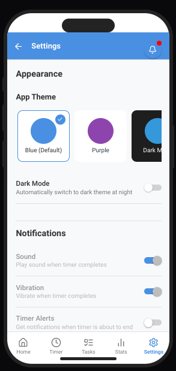

# 🕓 Study Sprint

**Study Sprint** is a mobile-first focus timer and productivity companion that helps you stay locked in and get work done. Whether you're studying, working, or journaling — this app keeps distractions out and focus in.

Designed for **iOS and Android** and optimized for touchscreen use.

---

## 🌟 Key Features

✅ **Custom Focus Timer**  
Choose your own session duration (1–120 minutes) or pick from presets.

✅ **Task List**  
Add tasks to focus on during each session and track progress.

✅ **Statistics Page**  
Visualize your productivity with session totals, average times, and more.

✅ **Break Timer (Coming Soon!)**  
Encourages healthier work sessions by balancing work and rest.

✅ **Dark Mode + Themes**  
Switch between color themes and toggle dark mode in Settings.

✅ **Mobile Optimized**  
Built specifically for smartphones — no keyboard needed.

✅ **Simple Onboarding**  
Get started quickly with a clean welcome message and feature summary.

---

## 📱 App Screenshots

  
  
  

  
  
  

---

## 🚀 How to Use

1. Choose your timer duration on the **Timer page**.
2. Add tasks to your **Task List** (optional but helpful).
3. Hit “Set” to start your session.
4. Stay focused — the app locks you into the timer until it finishes.
5. View your stats and keep building momentum.

---

## 📦 Tech Stack

- 🔧 [**Rork.app**](https://rork.app) — Visual app builder with multi-page support
- 💻 Custom CSS for styling and theme handling
- 📱 Mobile-first design using touch-based UI

---

## ✨ Coming Soon

- 🍅 Pomodoro Mode with break sessions
- 🔔 Notification support for timer completion
- 📅 Calendar-based session history
- 💬 Session notes / journal entries
- 🔒 Distraction lock toggle
- 🎵 Ambient sounds and motivational quotes

---

## 📄 License

This project is open-source and available under the [MIT License](LICENSE).

---

## 👋 About the Developer

Made by [@samsnow850](https://github.com/samsnow850) — student, creator, and productivity app lover.

> “Productivity isn’t about being perfect — it’s about staying focused for just one sprint at a time.”
